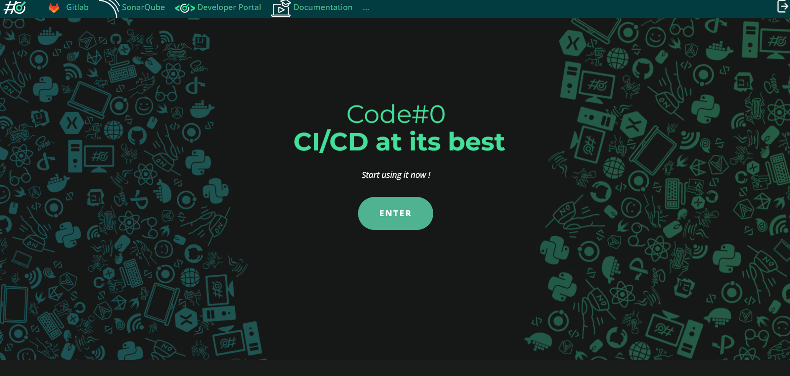

CodeFirst is a project that aims to provide, for IT students in the "BUT Informatique", a sandbox with a development and deployment environment for their projects that closely mirrors what they will encounter in professional settings. 

This project utilizes widely-used open-source or free tools, such as GitLab, SonarQube, and Minikube. We strive to keep these tools up to date so that the students' experience with CodeFirst will give them a valuable advantage when they transition to the workplace.

The CodeFirst project was conceived and initiated by Marc Chevaldonné, a computer science teacher-researcher at the University of Clermont Auvergne, who also led its previous version.

I've had the opportunity to work with him on the second version of this project since 2023.

My first contribution to the CodeFirst project was automating the deployment and configuration of all the middleware components.

I then implemented a backend API in Java using Quarkus to interact with the various APIs of CodeFirst components (Keycloak, GitLab, Kubernetes) to simplify platform maintenance. 

After that, I created a developer portal in ReactJS (using MUI for graphical components) that uses my Java API.
This portal is used by students to get a graphical view of the containers they have deployed in Kubernetes. 
Additionally, it helps facilitate the administration of the CodeFirst instance, including tasks like managing individual quotas, handling incidents reported by users, and monitoring the platform.

Source: <a href="https://github.com/codefirst63"><i class="large github icon "></i>codefirst63</a>

Note: For now, not all the repositories in the CodeFirst project are public. We're still working on making them available as we refine the project.