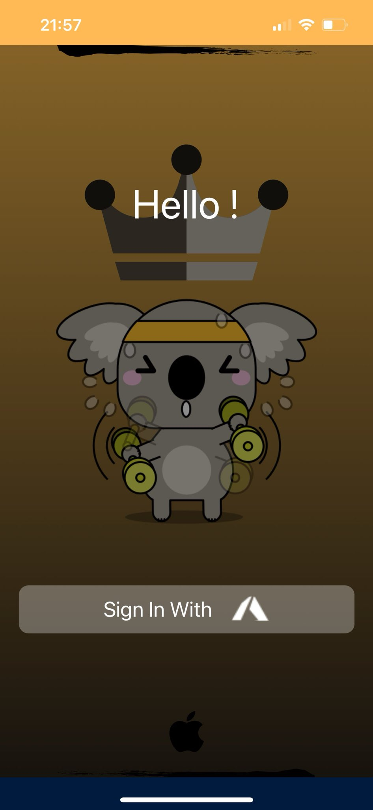
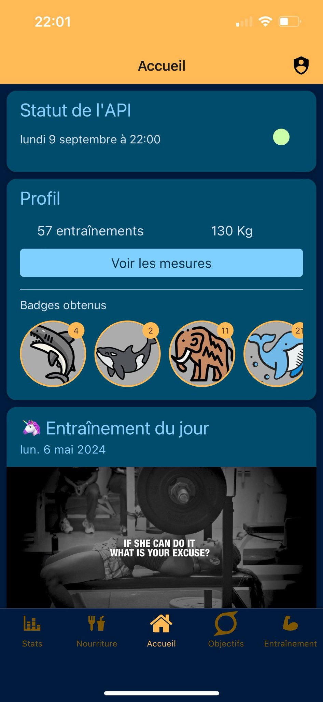
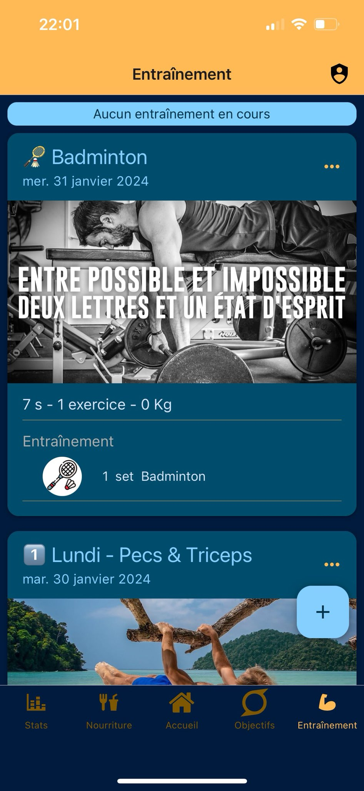
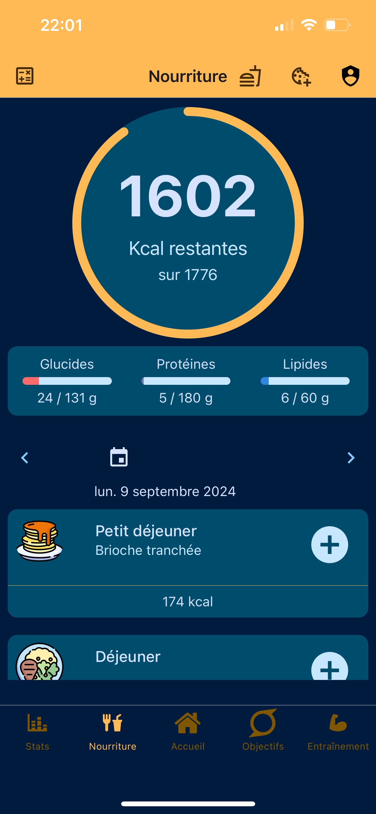

  
  
I created a mobile application that allows me to track the sports 
activities I do (weightlifting, badminton, cycling, etc.) as well as the macronutrients 
I consume daily. To motivate myself, I implemented a badge system in the mobile application. 
After each weightlifting session, the user is awarded a badge that corresponds to 
an animal whose weight is closest to the total amount lifted during the workout. 
This adds a fun and motivational element to track progress.  This application 
uses Microsoft Azure authentication with a backend built in Quarkus, 
which stores all the data in a CosmosDB document-based database.
  The mobile application is built in React Native 
(with Expo) and is deployed on my phone using a private Apple certificate.

  
  
  

Source: [Swagger UI API](https://follower-dev.azurewebsites.net/swagger-ui/)

