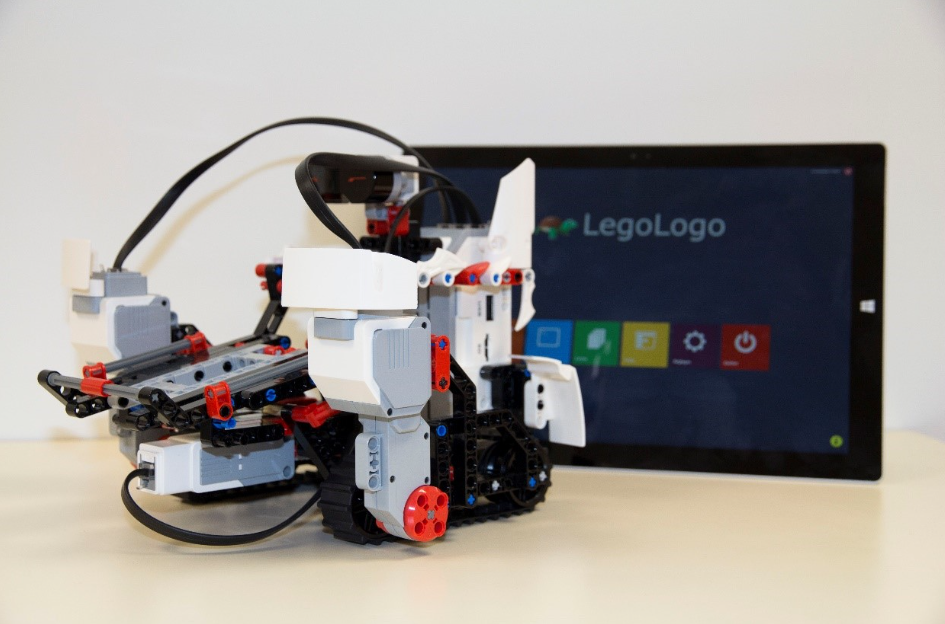
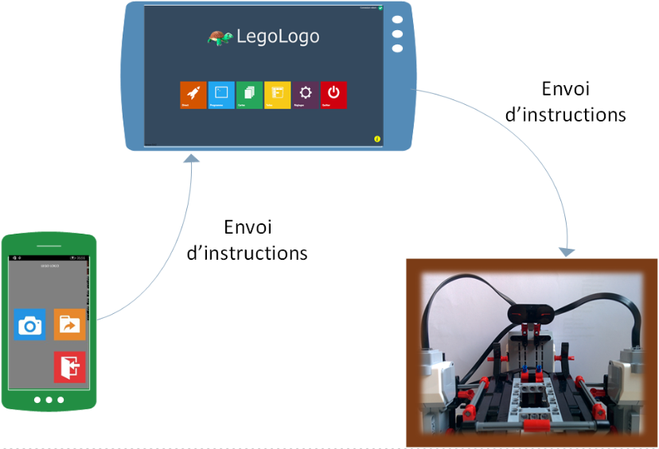
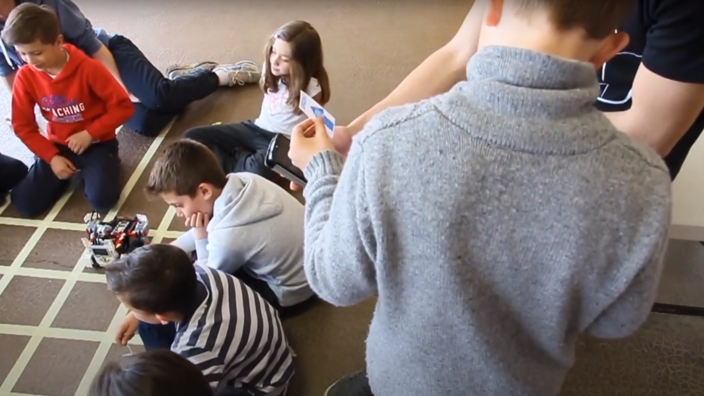

As part of our second year of studies at the IUT Informatique in Clermont-Ferrand, 
we had the opportunity to participate in a supervised project.
The goal was to develop a system for introducing algorithmic thinking to children aged
5 to 12. It was intended for the Astu'Sciences association, which aims to promote
scientific culture and learning methods. The final objective of this project was to 
create a "kit" that would be made available to schools in the region to introduce both
young and older students to algorithmic thinking through various games and activities 
it contains.

LegoLOGO is inspired by the LOGO turtle robot developed in the 1970s.

Like the original LOGO turtle, our robot had to be capable of movement and able to 
hold a pen to draw on the ground. The robot was designed to be controlled using a
phone or tablet, which would communicate with the robot’s main component, the brick.

We needed to control the robot using an API we developed in C# by building on open-source
work already available. This API allowed asynchronous communication with the robot,
sending simple commands like rotating a motor for 500 milliseconds or playing a sound.
However, for our project, we created synchronous functions using these commands.
The API included features like moving forward, turning, connecting via Bluetooth,
saving multiple robot configurations, and executing a sequence of instructions.

Children will be able to use the robot in different game modes:
* __Card Mode__: Displays scanned cards with symbols and actions. Users can see the sequence of commands sent to the robot.
* __Tile Mode__: Children drag and drop squares representing robot actions, forming a stack of instructions they can reorder or delete before executing.
* __Program Mode__: Aimed at older kids, this mode simulates programming with keywords and allows them to create custom instructions using existing actions, teaching logic and programming basics.

The game and its various activities allow children to be introduced to algorithmic thinking. 
The challenge lies in understanding the sequence and distinction of actions that need to be performed.
Given the wide age range of the target audience, the project offers diverse activities 
with varying difficulty levels. To make the tool more accessible to younger children, 
familiar objects were used to simplify learning.

This learning process involves the use of Lego, playing cards, and electronic devices 
such as a tablet and smartphone. The goal of our work was to create an application that 
allows children to organize their ideas, create programs, and ultimately interact with
the robot. The app needed to be simple and user-friendly for children, with fully 
automated connection protocols for different components. In this report, we detail 
the technologies used, solutions to encountered problems, and present the application's
various available features.

This project utilized Lego Mindstorms EV3 robots, controlled via Bluetooth using an application written in C# (WPF).

To facilitate communication between the various devices in our project, 
we needed to use wireless communication. Two technologies were available:
Bluetooth and Wi-Fi. We quickly dismissed Wi-Fi due to the need for additional hardware,
such as a router. Therefore, we focused on the Bluetooth protocol.
In this setup, the phone doesn't communicate directly with the robot but interacts 
only with the tablet. The phone scans the cards and sends them to the tablet, which 
displays the instructions and forwards them to the robot. This process is also used 
in the card and tile modes, where the phone isn't required. The tablet handles the 
execution of instructions sent to the robot in these cases.

I would like to thank my teammates on this project: [Thomas Perrin](https://fr.linkedin.com/in/thomas-lb-perrin),
[Théo Depresle](https://fr.linkedin.com/in/dprslt), [Jonathan Huteau](https://fr.linkedin.com/in/jonathan-huteau),
[Yannick Dieu](https://fr.linkedin.com/in/yannick-dieu-318730a5), [Morgane Bichet](https://fr.linkedin.com/in/morgane-bichet-bdia)
and [Marc Chevaldonné](https://fr.linkedin.com/in/marc-chevaldonn%C3%A9-8902a0205), the teacher who guided us throughout the entire process. 
We had the opportunity to present our project at the Exposciences International in 
Brussels in 2015.

