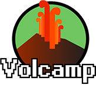

For the Volcamp event, with the help of my intern [Rami Khedair](https://fr.linkedin.com/in/rami-khedair-022a141a4), we developed a web application 
that gathered all the talks and workshops of the annual Volcamp conference. 
This tool helped guide participants to the correct rooms and allowed them to 
create their own personalized event schedule. It was a useful feature to enhance 
the participant experience during the conference.

We developed a PWA web application using Angular, supported by a Java Quarkus microservice.
This microservice was connected to a PostgreSQL database to retrieve the necessary 
data for the Volcamp event. This setup allowed participants to easily access all 
the information about the talks and workshops and create their personalized schedules 
for the conference.
 
Source: <a href="https://github.com/Volcamp/volcampanion"><i class="large github icon "></i>Volcampanion</a>

Note: I would like to thank [CleverCloud](https://www.clever-cloud.com/fr/home/) which allows Volcamp to use their platform for hosting our project during the event every year.
